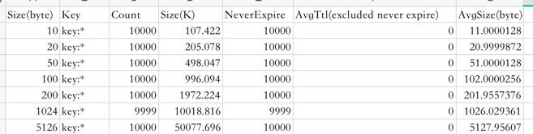

###  redis性能测试

```
➜  ~ redis-benchmark  -d 10 -t get -q
GET: 80385.85 requests per second, p50=0.295 msec

➜  ~ redis-benchmark  -d 10 -t set -q
SET: 76335.88 requests per second, p50=0.327 msec

➜  ~ redis-benchmark  -d 20 -t get -q
GET: 81766.15 requests per second, p50=0.287 msec

➜  ~ redis-benchmark  -d 20 -t set -q
SET: 82781.46 requests per second, p50=0.295 msec

➜  ~ redis-benchmark  -d 50 -t get -q
GET: 81433.22 requests per second, p50=0.287 msec

➜  ~ redis-benchmark  -d 50 -t set -q
SET: 81699.35 requests per second, p50=0.303 msec

➜  ~ redis-benchmark  -d 100 -t get -q
GET: 83056.48 requests per second, p50=0.295 msec

➜  ~ redis-benchmark  -d 100 -t set -q
SET: 85251.49 requests per second, p50=0.295 msec

➜  ~ redis-benchmark  -d 200 -t get -q
GET: 83194.67 requests per second, p50=0.295 msec

➜  ~ redis-benchmark  -d 200 -t set -q
SET: 84033.61 requests per second, p50=0.295 msec

➜  ~ redis-benchmark  -d 1024 -t get -q
GET: 83263.95 requests per second, p50=0.295 msec

➜  ~ redis-benchmark  -d 1024 -t set -q
SET: 83963.05 requests per second, p50=0.295 msec

➜  ~ redis-benchmark  -d 5120 -t get -q
GET: 82440.23 requests per second, p50=0.295 msec

➜  ~ redis-benchmark  -d 5120 -t set -q
SET: 76804.91 requests per second, p50=0.319 msec


➜  ~ redis-benchmark  -d 5120 -t set,get -r 10000 -n 100000  -P 20 -q
SET: 154559.50 requests per second, p50=1.055 msec
GET: 200803.22 requests per second, p50=2.951 msec

➜  ~ redis-benchmark  -d 1024 -t set,get -r 10000 -n 100000  -P 20 -q
SET: 312500.00 requests per second, p50=1.735 msec
GET: 458715.59 requests per second, p50=1.935 msec

➜  ~ redis-benchmark  -d 200 -t set,get -r 10000 -n 100000  -P 20 -q
SET: 413223.16 requests per second, p50=2.111 msec
GET: 595238.12 requests per second, p50=1.407 msec

➜  ~ redis-benchmark  -d 100 -t set,get -r 10000 -n 100000  -P 20 -q
SET: 429184.56 requests per second, p50=2.015 msec
GET: 606060.56 requests per second, p50=1.407 msec

➜  ~ redis-benchmark  -d 50 -t set,get -r 10000 -n 100000  -P 20 -q
SET: 354609.94 requests per second, p50=2.287 msec
GET: 555555.56 requests per second, p50=1.503 msec

➜  ~ redis-benchmark  -d 20 -t set,get -r 10000 -n 100000  -P 20 -q
SET: 440528.62 requests per second, p50=1.911 msec
GET: 537634.38 requests per second, p50=1.543 msec

➜  ~ redis-benchmark  -d 10 -t set,get -r 10000 -n 100000  -P 20 -q
SET: 505050.50 requests per second, p50=1.671 msec
GET: 662251.69 requests per second, p50=1.279 msec
```
-  写入一定量的 kv 数据, 根据数据大小 1w-50w 自己评估, 结合写入前后的 info memory 信息 , 分析上述不同 value 大小下，平均每个 key 的占用内存空间


